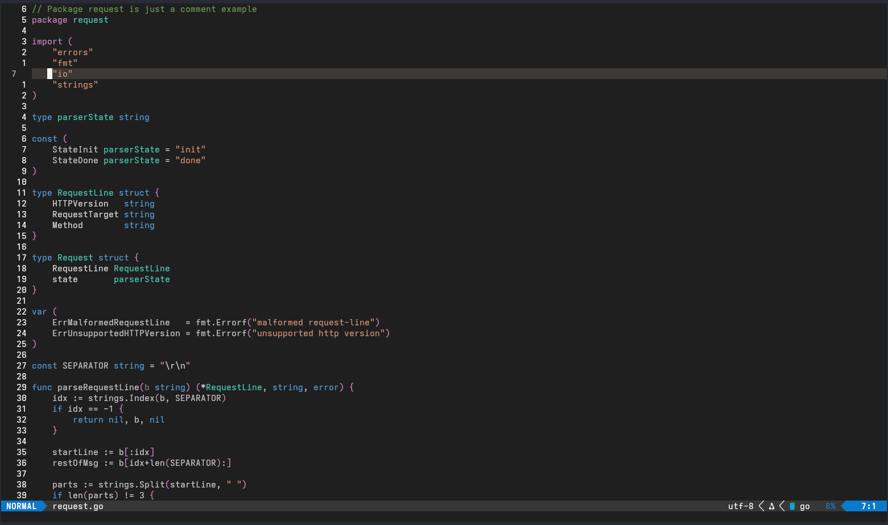

## 2017 Dark

This is an attempt to bring the VSCode Microsoft 2017 Dark theme so I can use it in my personal Neovim setup.
It does not contain configurations or support for a light/white theme.

Forked and customized from Mofiqul/vscode.nvim.

```lua
{ "adalbertjnr/2017dark.nvim", lazy = false, priority = 1000 }
```

<br>


